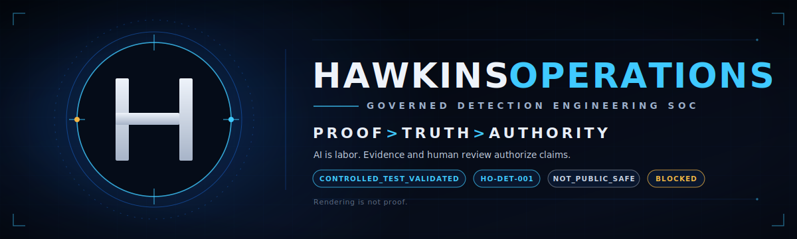

# HawkinsOperations
## Claim-Control System for AI-Assisted Detection Engineering

**Agents generate work. The system promotes claims.**

HawkinsOperations is a claim-control system for AI-assisted detection engineering and SOC automation where AI can generate work, but evidence and human review authorize claims.

It demonstrates detection-as-code, validation fixtures, runtime contracts, proof records, public claim boundaries, and AI-assisted security operations without letting speed outrun evidence.

## Current Public Boundary

| Boundary | Current state |
|---|---|
| Flagship reviewer path | `HO-DET-001` |
| Public proof ceiling | `TEST_VALIDATED_SYNTHETIC_SCOPE` |
| Public-safe status | `NOT_PUBLIC_SAFE` |
| Website/GitHub status | Rendering and reviewer routing only |
| Runtime-active public claim | `BLOCKED` |
| Public signal-observed claim | `BLOCKED` |
| Production / fleet / autonomous SOC claim | `BLOCKED` |

Website/GitHub rendering is not proof. Public surfaces route reviewers to proof records, validation artifacts, and claim boundaries.

## Why This Matters

Most AI-assisted work fails at the authority boundary: models generate output, people mistake output for proof, and public claims outrun evidence.

HawkinsOperations treats AI output as work product, not authority. Work must pass scoped validation, preserve claim ceilings, avoid private leakage, and route through human review before it becomes a public claim.

## Agent Launch Controls

These are the claim-control workflow expectations for agent-assisted work. They are reviewer-routing controls unless a repo also backs them with branch protection, rulesets, blocking CI, deterministic verifiers, typed gates, or another enforceable mechanism.

| Control | Purpose |
|---|---|
| Fixed working directory | Agents start from known paths |
| `AGENTS.md` launch contract | Repo-specific rules load before work |
| Control-folder routing | Governance docs are discoverable |
| Path restrictions | Agents stay inside approved surfaces |
| Stop conditions | Work halts on dirty state, scope conflict, private leakage, or claim risk |
| Controlled logging | Meaningful sessions append operator-visible records |

## Promotion Ladder

| Level | Surface | Role | Boundary |
|---|---|---|---|
| 1 | `.github` | Claim-control / reviewer routing | Routes expectations; not proof |
| 2 | `detections` | Source logic | Source exists; source is not runtime |
| 3 | `validation` | Tests / fixtures / verifiers | Synthetic pass is not live signal |
| 4 | `platform` | Runtime contracts / integration guardrails | Contract pass is not public proof |
| 5 | `proof` | Evidence records / claim ceilings | Claims require evidence and review |
| 6 | `website` | Public rendering | Rendering is not proof |

Higher surfaces can only inherit bounded truth from lower surfaces.

Work can move upward only when lower-surface rules are satisfied, claim ceilings are preserved, private leakage is absent, and explicit review approves promotion.

## Repo Map

| Repo | Owns | Does not prove alone |
|---|---|---|
| `.github` | Org profile, reviewer routing, claim-control front door | Runtime, signal, evidence, production |
| `hawkinsoperations-detections` | Detection source truth | Live firing or deployment |
| `hawkinsoperations-validation` | Validation behavior truth | Production runtime or public signal |
| `hawkinsoperations-platform` | Runtime contracts and integration guardrails | Public-safe runtime proof |
| `hawkinsoperations-proof` | Evidence records and claim ceilings | Claims beyond the recorded ceiling |
| `hawkinsoperations-website` | Public rendering and reviewer route | Source, runtime, signal, or evidence truth |

## Current Flagship: HO-DET-001

`HO-DET-001` is the current flagship reviewer path. Source exists, Splunk source exists, and controlled synthetic validation passed within the recorded scope.

Private/internal controlled lab runtime match status is tracked separately from public-safe proof. The public ceiling remains `TEST_VALIDATED_SYNTHETIC_SCOPE`, public-safe status remains `NOT_PUBLIC_SAFE`, and public runtime/signal proof remains blocked.

| Item | Current state |
|---|---|
| Source | Exists |
| Splunk source | Exists |
| Synthetic validation | Passed within controlled scope |
| Platform contract guardrail | Exists as non-promotional guardrail |
| Private/internal runtime status | `CONTROLLED_LAB_RUNTIME_MATCH_VERIFIED` |
| Public ceiling | `TEST_VALIDATED_SYNTHETIC_SCOPE` |
| Public-safe status | `NOT_PUBLIC_SAFE` |
| Public runtime/signal proof | `BLOCKED` |

## Current Claim Boundary

The left column lists what the current public ceiling supports. The right column lists claims this README explicitly does not make.

| Supported within current public ceiling | Explicitly not claimed |
|---|---|
| Source exists | runtime-active public proof |
| Splunk source exists | signal-observed public proof |
| Synthetic validation passed within controlled scope | public-safe status |
| Platform contract guardrail exists as non-promotional guardrail | evidence-linked public proof |
| Private/internal runtime match status is scoped private/internal | public-safe runtime proof |
| Reviewer routing preserves `TEST_VALIDATED_SYNTHETIC_SCOPE` | production-ready claim, fleet-wide claim, enterprise deployed claim |
| AI is support labor, not authority | Cribl-routed claim, Wazuh-routed claim, AWS-live claim |
| Human review is required for promotion | autonomous SOC claim, AI-approved disposition, AI-decided disposition, analyst-approved disposition, production AutoSOC claim |

## What This Prevents

- AI-generated output promoted as authority
- source treated as runtime proof
- synthetic validation treated as live signal
- platform contracts treated as public proof
- dashboards treated as evidence
- private evidence leaking into public claims
- green checks mistaken for merge authority

## Reviewer Route

- [Start Here](./START_HERE.md)
- [Control Status Matrix](../governance/CONTROL_STATUS_MATRIX.md)
- [PR Review Authority](../governance/PR_REVIEW_AUTHORITY.md)
- [Proof repo](https://github.com/HawkinsOperations/hawkinsoperations-proof)
- [Validation repo](https://github.com/HawkinsOperations/hawkinsoperations-validation)
- [Detections repo](https://github.com/HawkinsOperations/hawkinsoperations-detections)
- [Platform repo](https://github.com/HawkinsOperations/hawkinsoperations-platform)
- [Website](https://hawkinsoperations.com/)

## Real Controls Rule

Docs, READMEs, diagrams, issue cards, and websites are not real controls by themselves.

A control becomes real only when it blocks, fails, or forces correction through required review, branch protection, rulesets, blocking CI, deterministic verifiers, typed claim gates, or another enforceable mechanism.

Green CI/status checks are not merge authority.

Codex review is AI labor, not human review authority.

## Legacy Boundary

HawkinsOps / hawkinsops.com is legacy/reference unless explicitly promoted by current HawkinsOperations proof records.

Current claims live under HawkinsOperations proof boundaries.

## Doctrine

**AI generates work. Evidence and human review authorize claims.**

**Build loud. Verify hard. Claim tight. Ship receipts.**
