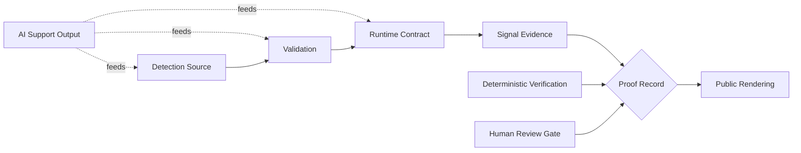
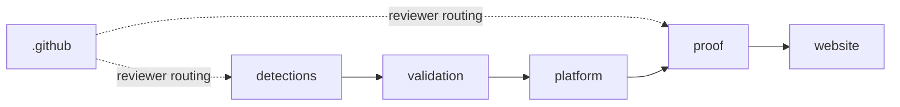

# HawkinsOperations

**Governed detection engineering and SOC automation**

_AI generates work. Evidence and human review authorize claims._

`CONTROLLED_TEST_VALIDATED` &nbsp;&middot;&nbsp; `NOT_PUBLIC_SAFE` &nbsp;&middot;&nbsp; `HO-DET-001` &nbsp;&middot;&nbsp; `RENDERING_NOT_PROOF` &nbsp;&middot;&nbsp; `HUMAN_REVIEW_REQUIRED`

---

## If You Are Reviewing This Org, Start Here

A 90-second reviewer path. Each row is a single click and what it answers.

| # | Click | What it answers |
|:---:|---|---|
| 01 | [`START_HERE.md`](./START_HERE.md) | What this org is and how to read it |
| 02 | [Control Status Matrix](../governance/CONTROL_STATUS_MATRIX.md) | Which review gates are enforced today |
| 03 | [Cross-Repo Promotion Map](../governance/CROSS_REPO_PROMOTION_MAP.md) | How work moves between truth surfaces |
| 04 | [HO-DET-001 Proof Record](https://github.com/HawkinsOperations/hawkinsoperations-proof/blob/main/proof/records/HO-DET-001.md) | The flagship review path and its current ceiling |
| 05 | [hawkinsoperations.com](https://hawkinsoperations.com/) | Public rendering only - not proof |

---

## Reviewer Routes

<table>
<tr>
<td width="33%" valign="top">

### Executive Route
**For:** security leads and nontechnical reviewers scanning for credibility.

Read the doctrine, the public boundary table, and the architecture diagram. That is enough to decide whether to route this to a technical reviewer.

_Time: ~3 minutes._

</td>
<td width="33%" valign="top">

### Technical Route
**For:** detection engineers, platform engineers, SOC automation leads.

Open [`hawkinsoperations-detections`](https://github.com/HawkinsOperations/hawkinsoperations-detections) for source, [`hawkinsoperations-validation`](https://github.com/HawkinsOperations/hawkinsoperations-validation) for tests and fixtures, [`hawkinsoperations-platform`](https://github.com/HawkinsOperations/hawkinsoperations-platform) for runtime contracts.

_Time: ~15 minutes._

</td>
<td width="34%" valign="top">

### Proof Route
**For:** reviewers who want to verify, not browse.

Open [`hawkinsoperations-proof`](https://github.com/HawkinsOperations/hawkinsoperations-proof) and read the [HO-DET-001 record](https://github.com/HawkinsOperations/hawkinsoperations-proof/blob/main/proof/records/HO-DET-001.md). Confirm the claim ceiling, the evidence chain, and the review gate before treating anything here as more than rendering.

_Time: ~10 minutes._

</td>
</tr>
</table>

---

## Architecture: How a Claim Earns Its Way to the Public Surface

AI support output feeds source, validation, and runtime work - it does not authorize promotion. Deterministic verification and human review are required gates before a proof record can support public wording. Public rendering is downstream of proof and cannot create it. Public ceiling remains `CONTROLLED_TEST_VALIDATED`.

---

## Repo Relationship Map

Six repos exist because six truth surfaces need to stay separable. `.github` is orthogonal - it routes reviewers; it does not sit in the claim chain. The other five repos form the linear path a claim must walk before it can appear on a public surface.

---

## Six-Surface Truth Flow

| Surface | Owns | Does not own |
|---|---|---|
| **Source** | Detection logic, hypotheses, rule definitions | Test pass, runtime fit, public wording approval |
| **Validation** | Tests, fixtures, deterministic checks against source | Runtime behavior, signal observation |
| **Runtime** | Contracts, integration boundaries, interface guarantees | Proof of live observation, public-safe status |
| **Signal** | Runtime evidence candidates, only when captured and scoped | Source correctness, claim ceiling decisions |
| **Evidence** | Proof records, claim ceilings, review attestations | Source authorship, public presentation |
| **Public Rendering** | Website and GitHub presentation | Proof of any kind |

Public rendering cannot create proof. It can only present wording that is supported by proof records and review.

---

## Current Public Boundary

| Item | State |
|---|---|
| Flagship review path | `HO-DET-001` |
| Public proof ceiling | `CONTROLLED_TEST_VALIDATED` |
| Public-safe status | `NOT_PUBLIC_SAFE` |
| Website / GitHub status | Rendering and reviewer routing only |
| Runtime-active public claim | `BLOCKED` |
| Signal-observed public claim | `BLOCKED` |
| Production / fleet / autonomous claim | `BLOCKED` |

Website/GitHub rendering is not proof.

---

## Repo Map

<table>
<tr>
<td width="33%" valign="top">

#### `.github`
Org profile, reviewer routing, claim-tight wording, control labels.

**Owns:** front-door presentation and reviewer entry points.
**Does not prove:** source correctness, runtime fit, or any public claim.

</td>
<td width="33%" valign="top">

#### [`hawkinsoperations-detections`](https://github.com/HawkinsOperations/hawkinsoperations-detections)
Detection logic and hypotheses as source.

**Owns:** rule definitions, source-level structure, detection authorship.
**Does not prove:** that source passes tests, runs in any environment, or has been observed.

</td>
<td width="34%" valign="top">

#### [`hawkinsoperations-validation`](https://github.com/HawkinsOperations/hawkinsoperations-validation)
Tests, fixtures, and deterministic checks.

**Owns:** validation artifacts and pass/fail outcomes against source.
**Does not prove:** runtime fit or signal observation.

</td>
</tr>
<tr>
<td valign="top">

#### [`hawkinsoperations-platform`](https://github.com/HawkinsOperations/hawkinsoperations-platform)
Runtime contracts and integration boundaries.

**Owns:** interface guarantees and runtime-side definitions.
**Does not prove:** that contracts have produced public-safe observations.

</td>
<td valign="top">

#### [`hawkinsoperations-proof`](https://github.com/HawkinsOperations/hawkinsoperations-proof)
Proof records, claim ceilings, review attestations.

**Owns:** proof records, claim ceilings, and evidence-backed wording.
**Does not prove:** anything beyond the recorded claim ceiling and linked evidence.

</td>
<td valign="top">

#### [`hawkinsoperations-website`](https://hawkinsoperations.com/)
Public rendering and reviewer routing.

**Owns:** how authorized claims are presented to the public.
**Does not prove:** anything. Rendering is not proof.

</td>
</tr>
</table>

---

## Current Scaling Track

Active work, not completed proof.

- **Front door polish** - org profile and reviewer entry points
- **Cross-repo propagation block** - preventing claim drift between truth surfaces
- **Proof records index** - discoverable map of authorized records
- **Validation CI visibility** - surfacing pass/fail status without overstating it
- **Next detection candidate** - selected only after validation and proof lanes are clean

---

## Real Control

Repo separation creates review boundaries. Real control comes from required review, deterministic verification, CI checks, proof records, and bounded public wording. The split is necessary; it is not sufficient. Treat the boundary as the artifact, not the architecture diagram.

---

## Doctrine

**AI generates work. Evidence and human review authorize claims.**

**Build loud. Verify hard. Claim tight. Ship receipts.**

_Website/GitHub rendering is not proof._

