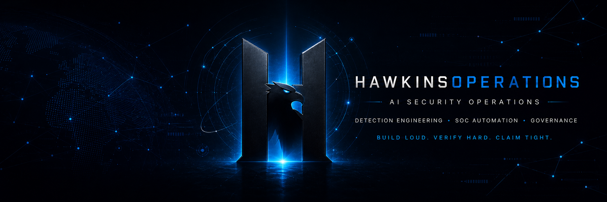
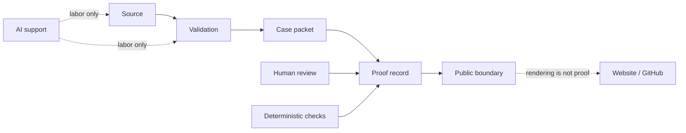

<p align="center">
  
</p>

<div align="center">

# HawkinsOperations

**HawkinsOperations is a governed detection-engineering system and GitHub-native command center that lets AI accelerate security work while evidence and human review authorize claims.**

`CONTROLLED_TEST_VALIDATED` · `HO-DET-001` · `NOT_PUBLIC_SAFE` · `RENDERING_NOT_PROOF` · `HUMAN_REVIEW_REQUIRED`

[Proof Pack 001 release](https://github.com/HawkinsOperations/hawkinsoperations-proof/releases/tag/hawkinsoperations-proof-pack-001) · [Proof Pack 001 Discussion](https://github.com/orgs/HawkinsOperations/discussions/32) · [hawkinsoperations.com](https://hawkinsoperations.com/) · [HO-DET-001 proof route](https://hawkinsoperations.com/proof/ho-det-001/) · [proof repo](https://github.com/HawkinsOperations/hawkinsoperations-proof) · [validation repo](https://github.com/HawkinsOperations/hawkinsoperations-validation) · [detections repo](https://github.com/HawkinsOperations/hawkinsoperations-detections)

</div>

---

## HawkinsOperations Control Panel

GitHub/org rendering is routing, not proof. Proof records live in [hawkinsoperations-proof](https://github.com/HawkinsOperations/hawkinsoperations-proof), and the current public ceiling remains `CONTROLLED_TEST_VALIDATED` unless a specific proof record says otherwise. Runtime, signal, public-safe, production, autonomous SOC, AI-approved disposition, and analyst-approved disposition claims remain blocked unless explicitly proven and approved.

| Command center view | Current route | Boundary |
|---|---|---|
| Six-repo architecture | [Repository Authority Map](../architecture/REPO_AUTHORITY_MAP.md) | Repos own separate truth surfaces; no repo may claim another repo's authority. |
| Proof chain | Detection source -> validation -> case packet -> proof record -> public rendering | Public rendering routes reviewers; it does not create proof. |
| Truth surfaces | [Six truth surfaces](#six-truth-surfaces) | Source, validation, runtime, signal, evidence, and public rendering stay separate. |
| Front-door/status proof ceiling | `SCHEMA_CONTRACT_VERIFIER_EXISTS_ONLY` | Applies to command-center and ledger-status routing; HO-DET-001 proof records keep their own proof ceiling. |
| Current ledger status | [Lifetime Case Ledger public summary](https://github.com/HawkinsOperations/hawkinsoperations-proof/blob/main/proof/records/lifetime-case-ledger-v1-public-summary.json) | 4 ledger events, 4 total cases, 0 public-safe cases, 0 closed cases; ledger status remains `NOT_PUBLIC_SAFE`. |
| Project operating cockpit | [private org Control Board route](https://github.com/orgs/HawkinsOperations/projects/2) | Canonical private HawkinsOperations Control Board; Project #1 is not an active reviewer route; project metadata is not proof, approval, runtime, signal, public-safe status, or merge authority. |
| Reviewer/demo path | [Start Here 30-second path](START_HERE.md#30-second-reviewer-path) and [Reproducible Reviewer Path](../architecture/REPRODUCIBLE_REVIEWER_PATH.md) | Demo routing does not raise the claim ceiling. |
| Command-center invariant check | [`python scripts/verify-command-center-invariants.py`](../scripts/verify-command-center-invariants.py) | Verifier control for route and claim-boundary invariants; it does not create runtime, signal, public-safe, or proof authority. |

| Reviewer need | Route |
|---|---|
| Start the review | [Start Here](START_HERE.md) |
| See repo authority boundaries | [Repository Authority Map](../architecture/REPO_AUTHORITY_MAP.md) |
| Check control status wording | [Control Status Matrix](../governance/CONTROL_STATUS_MATRIX.md) |
| Inspect standing controls | [Standing control registers](../governance/ISSUE_FACTORY_CONTROL_RECEIPTS.md) |
| Inspect proof records | [hawkinsoperations-proof](https://github.com/HawkinsOperations/hawkinsoperations-proof) |
| Inspect validators and case packets | [hawkinsoperations-validation](https://github.com/HawkinsOperations/hawkinsoperations-validation) |
| Inspect detection source | [hawkinsoperations-detections](https://github.com/HawkinsOperations/hawkinsoperations-detections) |
| Inspect platform contracts | [hawkinsoperations-platform](https://github.com/HawkinsOperations/hawkinsoperations-platform) |
| Inspect public rendering | [hawkinsoperations-website](https://github.com/HawkinsOperations/hawkinsoperations-website) |

The private Control Board supports internal governance and navigation. It is not proof, not public evidence, and not a public-safe approval surface.

The private org Control Board is the private Project #2 operating cockpit for current work visibility. Project #1 is not an active reviewer route and was not resolvable through the live ProjectV2 API during the current cleanup pass. The board is useful for navigation, queue review, and sprint context only; it does not mutate proof state, authorize merge, approve public wording, or promote public-safe status.

---

## Fast reviewer paths

| Time | Route | Boundary |
|---:|---|---|
| 30 sec | Open [Start Here](START_HERE.md), then [Control Status Matrix](../governance/CONTROL_STATUS_MATRIX.md). | Confirms the command center, current ceiling, and blocked claims. |
| 3 min | Follow [Start Here](START_HERE.md) through Project #2, repo authority, standing controls, and the HO-DET-001 proof record. | Project metadata remains coordination-only. Proof stays in `hawkinsoperations-proof`. |
| 10 min | Run the [Reproducible Reviewer Path](../architecture/REPRODUCIBLE_REVIEWER_PATH.md) and the command-center invariant verifier. | Clone-runnable inspection and invariant checks only; no private runtime access or proof promotion. |

---

## The enterprise AI failure mode

AI can accelerate security work. It cannot authorize the truth.

Without a control system, AI-generated output becomes a public claim, an analyst conclusion, an operational action, a security disposition, and an executive truth — before any evidence or human review ever authorized it.

```text
   AI OUTPUT
       │
       ▼
   UNVERIFIED CLAIM
       │
       ▼
   OPERATIONAL ACTION
       │
       ▼
   SECURITY DISPOSITION
       │
       ▼
   EXECUTIVE TRUTH                ✕  BLOCKED  ✕
```

This is the failure mode HawkinsOperations is built to prevent.

---

## The HawkinsOperations control route

AI labor enters the system. Source, validation, deterministic verification, evidence records, proof records, and human review stand between labor and any public claim.

```text
   AI LABOR
       │  scoped: drafts, scaffolds, summaries — never authorization
       ▼
   SOURCE                         hawkinsoperations-detections
       │
       ▼
   CONTROLLED VALIDATION          hawkinsoperations-validation
       │
       ▼
   DETERMINISTIC VERIFIER         fixtures · checks · CI gates
       │
       ▼
   EVIDENCE RECORD                bounded, scoped, reviewable
       │
       ▼
   PROOF RECORD                   hawkinsoperations-proof
       │
       ▼
   HUMAN REVIEW                   required · not delegable to AI
       │
       ▼
   PUBLIC BOUNDARY                hawkinsoperations.com · .github
```

**AI generates work. Evidence and human review authorize claims.**

---

## Proof Pack 001 — released

<table>
<tr>
<td width="55%" valign="top">

**HO-DET-001 reviewer release package**

The official, bounded reviewer route for the HO-DET-001 detection: source, validation, case packet, proof record, and the public boundary — packaged as one bounded reviewer ZIP and one GitHub Release.

- Release: [hawkinsoperations-proof-pack-001](https://github.com/HawkinsOperations/hawkinsoperations-proof/releases/tag/hawkinsoperations-proof-pack-001)
- Discussion: [HawkinsOperations Proof Pack 001 Released](https://github.com/orgs/HawkinsOperations/discussions/32)
- Asset: `HAWKINSOPERATIONS_PROOF_PACK_001.zip`
- ZIP SHA256: `44d8a643aa2b113c9e99be0462e699d39af707a67190823cc05bb381907dc452`

</td>
<td width="45%" valign="top">

**What this release is**

| Field | Value |
|---|---|
| Public proof ceiling | `CONTROLLED_TEST_VALIDATED` |
| Reviewer package status | `BOUNDED_REVIEWER_RELEASE_CANDIDATE` |
| Raw/private runtime evidence | `NOT_PUBLIC_SAFE` |
| Public-safe runtime proof | `BLOCKED` |
| Rendering of this page | `RENDERING_NOT_PROOF` |

</td>
</tr>
</table>

**What this release does not prove.** It is a reviewer route and a bounded ZIP. It does not promote runtime-active public proof, signal-observed public proof, public-safe runtime proof, production readiness, SOCaaS, autonomous SOC, AI-approved disposition, or analyst-approved disposition. Website/GitHub rendering is not proof.

---

## Current ledger status

The proof-owned Lifetime Case Ledger public summary is a bounded count and boundary route. It currently records:

| Ledger field | Current source-controlled value |
|---|---|
| Total ledger events | 4 |
| Total cases | 4 |
| Public-safe count | 0 |
| Closed-case count | 0 |
| Appended detections | `HO-DET-001`, `HO-DET-011`, `HO-DET-012` |
| Ledger public-safe status | `NOT_PUBLIC_SAFE` |
| Ledger proof ceiling | `SCHEMA_CONTRACT_VERIFIER_EXISTS_ONLY` |

This ledger route does not prove runtime activity, signal observation, production deployment, SOCaaS availability, public-safe runtime proof, public proof, autonomous SOC authority, AI-approved final disposition, analyst-approved final disposition, or case closure authority.

---

## Reviewer routes

Pick the route that matches your review job. The route changes how you inspect the system; it does not change the proof state.

| Route | Time | What you inspect | Start here |
|---|---:|---|---|
| Hiring manager | 3 min | What the system is, what is proven, what stays blocked. | [Start Here](START_HERE.md) |
| Detection engineer | 10 min | Detection source, validation scope, HO-DET-001 path. | [detections repo](https://github.com/HawkinsOperations/hawkinsoperations-detections) |
| SOC automation lead | 10 min | Case packet flow, deterministic checks, CI boundaries, runtime-contract separation. | [validation repo](https://github.com/HawkinsOperations/hawkinsoperations-validation) |
| AI governance reviewer | 10 min | Where AI supports labor and where human review authorizes claims. | [proof repo](https://github.com/HawkinsOperations/hawkinsoperations-proof) |
| Demo reviewer | 8 min | Command-center route, project cockpit, Proof Pack 001, and reproducible reviewer path. | [Start Here](START_HERE.md) |
| Cyber Kill Chain reviewer | 10 min | Attack-lifecycle coverage map across source, validation, proof, platform contracts, and blocked claims. | [Cyber Kill Chain coverage map](https://github.com/HawkinsOperations/hawkinsoperations-proof/blob/main/docs/mappings/CYBER_KILL_CHAIN_COVERAGE.md) |
| Public rendering reviewer | 2 min | Public presentation and reviewer navigation only; rendering does not create proof. | [HO-DET-001 proof route](https://hawkinsoperations.com/proof/ho-det-001/) |

---

Org-level reviewer entry point: Cyber Kill Chain coverage lives in `hawkinsoperations-proof` as a public route-safe reviewer map. It is not public-safe approval, runtime proof, or proof authority.

## Six truth surfaces

Each surface supports its own claims, nothing more. Authority does not flow between them by presentation.

| Surface | Supports | Does not assert |
|---|---|---|
| Source truth | A source artifact exists and can be reviewed. | Deployment, runtime behavior, signal observation, or public proof. |
| Validation truth | A deterministic validation process passed inside its stated scope. | Runtime operation, public signal, or external-use authorization. |
| Runtime truth | A control or detection is active in a runtime environment when runtime evidence is reviewed. | Signal observation, evidence linkage, or public-safe proof. |
| Signal truth | A bounded signal was observed in a stated context when signal evidence is reviewed. | Fleet scope, production readiness, or public-safe status. |
| Evidence truth | A preserved artifact supports a specific bounded claim. | Claims outside the evidence boundary. |
| Public rendering | Website and GitHub presentation of reviewed routes and wording. | Proof of any kind. |



---

## Repository authority map

Six repositories. Three planes. Authority flows through scoped records, not presentation.

| Plane | Repository | Authority | Boundary |
|---|---|---|---|
| Governance / routing | `.github` | Organization profile, reviewer routing, control summaries. | Routes reviewers; does not prove source, runtime, signal, evidence, or public proof. |
| Authority chain | [`hawkinsoperations-detections`](https://github.com/HawkinsOperations/hawkinsoperations-detections) | Detection source logic and ownership trail. | Source does not prove validation or runtime. |
| Authority chain | [`hawkinsoperations-validation`](https://github.com/HawkinsOperations/hawkinsoperations-validation) | Fixtures, validators, case packets, deterministic checks. | Validation does not prove public runtime or signal state. |
| Internal / private runtime contract | `hawkinsoperations-platform` | Runtime contracts, interface boundaries, non-promotional guardrails. | Internal/private runtime-contract route; not a public proof route and not public proof. |
| Authority chain | [`hawkinsoperations-proof`](https://github.com/HawkinsOperations/hawkinsoperations-proof) | Proof records, claim ceilings, evidence boundary records, cited case packets. | Proof records do not publish private evidence or raise ceilings by presentation. |
| Rendering | [`hawkinsoperations-website`](https://hawkinsoperations.com/) | Public reviewer navigation and rendered wording. | Rendering is not proof and cannot approve a claim. |

Detections → validation → proof feeds the authority chain. `.github` routes reviewers. `hawkinsoperations-platform` remains an internal/private runtime-contract route. The website renders receipts; it does not author them.

---

## Claim firewall

Public wording passes through boundary review before it ships. Blocked terms stay listed because they describe what this surface does not assert.

Blocked unless separately promoted and approved:

`public-safe` · `production-ready` · `fleet-wide` · `live enterprise deployment` · `autonomous SOC` · `AI-approved disposition` · `analyst-approved disposition` · `runtime-active public proof` · `signal-observed public proof` · `evidence-linked public proof` · `live Splunk public proof` · `Cribl-routed public proof` · `Wazuh-routed public proof` · `AWS-live proof` · `customer-ready product` · `sold product` · `enterprise deployment`

Allowed public boundary for this profile:

| Field | Current value |
|---|---|
| Flagship path | `HO-DET-001` |
| Public proof ceiling | `CONTROLLED_TEST_VALIDATED` |
| Public-safe status | `NOT_PUBLIC_SAFE` |
| Surface mode | `RENDERING_NOT_PROOF` |
| Promotion authority | `HUMAN_REVIEW_REQUIRED` |
| Runtime-active public proof | `BLOCKED` |
| Signal-observed public proof | `BLOCKED` |
| Evidence-linked public proof | `BLOCKED` |
| Production / fleet / autonomous claim | `BLOCKED` |

---

## HO-DET-001 — flagship proof path

HO-DET-001 is the artifact reviewers can trace end to end without accepting a stronger public claim.

| Receipt | Review route | What it supports |
|---|---|---|
| Source | [Detection source repo](https://github.com/HawkinsOperations/hawkinsoperations-detections) | The detection source exists under version control. |
| Validation | [Validation repo](https://github.com/HawkinsOperations/hawkinsoperations-validation) | Controlled positive and negative test scope can be inspected. |
| Case packet | [Validation repo](https://github.com/HawkinsOperations/hawkinsoperations-validation) and [Proof repo](https://github.com/HawkinsOperations/hawkinsoperations-proof) | Case packets are produced/validated in validation and cited/recorded by proof. |
| Proof record | [HO-DET-001 proof record](https://github.com/HawkinsOperations/hawkinsoperations-proof/blob/main/proof/records/HO-DET-001.md) | The current public ceiling and blocked claims are recorded. |
| Public rendering | [HO-DET-001 public route](https://hawkinsoperations.com/proof/ho-det-001/) | Reviewer navigation only; rendering does not create proof. |

Public proof ceiling remains `CONTROLLED_TEST_VALIDATED`. Public-safe status remains `NOT_PUBLIC_SAFE`.

---

## Prior operating context

HawkinsOps V1 / SignalFoundry metrics are prior operating context only. They are not current HawkinsOperations proof and do not raise the current HawkinsOperations ceiling.

| Prior context | Boundary |
|---|---|
| 324,074 cases processed | Historical V1 / HawkinsOps context only. |
| 200+ detections built | Historical V1 / HawkinsOps context only. |
| 208/208 CI assertions | Historical V1 / HawkinsOps context only. |
| 39.7% reduction measured | Historical V1 / HawkinsOps context only. |
| 100% high-severity preservation | Historical V1 / HawkinsOps context only. |

Current HawkinsOperations claims are bounded by source, validation, evidence, and the public-proof surface.

---

## Real controls rule

Repo separation creates review boundaries. Real control comes from required review, deterministic verification, CI checks, proof records, and bounded public wording. The split is necessary; it is not sufficient. Treat the boundary as the artifact, not the architecture diagram.

---

<div align="center">

## AI is labor. Governance is authority.

**AI generates work. Evidence and human review authorize claims.**

**Build loud. Verify hard. Claim tight. Ship receipts.**

[Operator profile](https://github.com/raylee-hawkins) · [Proof ledger](https://hawkinsoperations.com/proof/) · [GitHub organization](https://github.com/HawkinsOperations)

</div>
