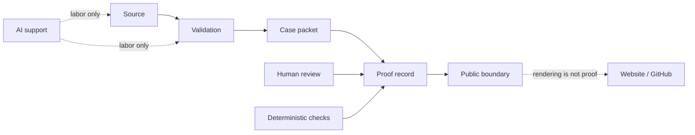

# HawkinsOperations

**Governed detection engineering · SOC automation · proof-routed claims**

AI generates work. Evidence and human review authorize claims.

HawkinsOperations is a governed SOC automation framework that separates generated work from authorized proof: detections, validation, case packets, AI support, deterministic checks, proof records, and public claim boundaries.

`CONTROLLED_TEST_VALIDATED` | `NOT_PUBLIC_SAFE` | `HO-DET-001` | `RENDERING_NOT_PROOF` | `HUMAN_REVIEW_REQUIRED`

[hawkinsoperations.com](https://hawkinsoperations.com/) | [HO-DET-001 proof route](https://hawkinsoperations.com/proof/ho-det-001/) | [Proof Pack 001 release](https://github.com/HawkinsOperations/hawkinsoperations-proof/releases/tag/hawkinsoperations-proof-pack-001) | [Proof Pack 001 Discussion](https://github.com/orgs/HawkinsOperations/discussions/32) | [proof repo](https://github.com/HawkinsOperations/hawkinsoperations-proof) | [validation repo](https://github.com/HawkinsOperations/hawkinsoperations-validation) | [detections repo](https://github.com/HawkinsOperations/hawkinsoperations-detections)

---

## Reviewer Cockpit

Five reviewer routes. The route changes how to inspect the system; it does not change the proof state.

| Route | Time | What to inspect | Start |
|---|---:|---|---|
| Hiring manager | 3 min | What the system is, what is proven, and what remains blocked. | [hawkinsoperations.com](https://hawkinsoperations.com/) |
| Detection engineer | 10 min | Detection source, validation scope, and the HO-DET-001 proof path. | [detections repo](https://github.com/HawkinsOperations/hawkinsoperations-detections) |
| SOC automation lead | 10 min | Case packet flow, deterministic checks, CI boundaries, and runtime-contract separation. | [validation repo](https://github.com/HawkinsOperations/hawkinsoperations-validation) |
| AI governance reviewer | 10 min | Where AI supports labor and where human review authorizes claims. | [proof repo](https://github.com/HawkinsOperations/hawkinsoperations-proof) |
| Public rendering reviewer | 2 min | Public presentation and reviewer navigation only; rendering does not create proof. | [HO-DET-001 proof route](https://hawkinsoperations.com/proof/ho-det-001/) |

Website/GitHub rendering is not proof. Public surfaces route reviewers to proof records.

---

## Artifact Machine

Eight stages. One direction. Generated work can enter the machine; only authorized proof can leave it as public wording.

| Stage | Receipt | Owner | Current boundary |
|---:|---|---|---|
| 01 | Source | [`hawkinsoperations-detections`](https://github.com/HawkinsOperations/hawkinsoperations-detections) | Detection source exists for review. |
| 02 | Validation | [`hawkinsoperations-validation`](https://github.com/HawkinsOperations/hawkinsoperations-validation) | Controlled-test validation can be inspected in its stated scope. |
| 03 | Case packet | [`hawkinsoperations-validation`](https://github.com/HawkinsOperations/hawkinsoperations-validation) -> [`hawkinsoperations-proof`](https://github.com/HawkinsOperations/hawkinsoperations-proof) | Case packets are produced and validated in validation, then cited and recorded by proof. |
| 04 | AI support | Scoped labor only | AI can draft, scaffold, summarize, and assist; AI cannot promote claims. |
| 05 | Verifier | Validation/proof checks | Deterministic checks protect the stated boundary where they are wired. |
| 06 | CI | Repo workflows | CI is a checked gate only for its exact configured scope. |
| 07 | Proof record | [`hawkinsoperations-proof`](https://github.com/HawkinsOperations/hawkinsoperations-proof) | Proof records state the ceiling, linked routes, and blocked claims. |
| 08 | Public boundary | [`hawkinsoperations-website`](https://github.com/HawkinsOperations/hawkinsoperations-website) and `.github` | Public surfaces render reviewed wording; they do not author proof. |

Current public ceiling: `CONTROLLED_TEST_VALIDATED`.

---

## HO-DET-001 Flagship Proof Path

HO-DET-001 is the artifact reviewers can trace end to end without accepting a stronger public claim.

| Receipt | Review route | What it supports |
|---|---|---|
| Source | [Detection source repo](https://github.com/HawkinsOperations/hawkinsoperations-detections) | The detection source exists under version control. |
| Validation | [Validation repo](https://github.com/HawkinsOperations/hawkinsoperations-validation) | Controlled positive and negative test scope can be inspected. |
| Case packet | [Validation repo](https://github.com/HawkinsOperations/hawkinsoperations-validation) and [Proof repo](https://github.com/HawkinsOperations/hawkinsoperations-proof) | Case packets are produced/validated in validation and cited/recorded by proof. |
| Proof record | [HO-DET-001 proof record](https://github.com/HawkinsOperations/hawkinsoperations-proof/blob/main/proof/records/HO-DET-001.md) | The current public ceiling and blocked claims are recorded. |
| Public rendering | [HO-DET-001 public route](https://hawkinsoperations.com/proof/ho-det-001/) | Reviewer navigation only; rendering does not create proof. |

Public proof ceiling remains `CONTROLLED_TEST_VALIDATED`. Public-safe status remains `NOT_PUBLIC_SAFE`.

---

## Proof Pack 001

Proof Pack 001 is the official reviewer release package for HO-DET-001. It routes reviewers to the bounded GitHub Release and approved ZIP asset in `hawkinsoperations-proof`.

| Item | Current public status |
|---|---|
| Package purpose | Reviewer package for tracing HO-DET-001 source, validation, case packet, proof record, and public boundary. |
| Official release | [hawkinsoperations-proof/releases/tag/hawkinsoperations-proof-pack-001](https://github.com/HawkinsOperations/hawkinsoperations-proof/releases/tag/hawkinsoperations-proof-pack-001) |
| Release asset | `HAWKINSOPERATIONS_PROOF_PACK_001.zip` |
| ZIP SHA256 | `44d8a643aa2b113c9e99be0462e699d39af707a67190823cc05bb381907dc452` |
| Public ceiling | `CONTROLLED_TEST_VALIDATED` |
| Reviewer package status | `PUBLIC_SAFE_REVIEWER_RELEASE_CANDIDATE` |
| Raw/private runtime evidence public-safe status | `NOT_PUBLIC_SAFE` |
| Public-safe runtime proof | `BLOCKED` |

The release is a reviewer route and bounded ZIP package. Website/GitHub rendering is not proof, and the release does not promote runtime-active public proof, signal-observed public proof, public-safe runtime proof, production readiness, SOCaaS, autonomous SOC, AI-approved disposition, or analyst-approved disposition.

---

## Claim Firewall

Public wording passes through boundary review before it ships. Blocked terms stay visible because they describe what this surface does not assert.

Blocked unless separately promoted and approved:

`public-safe` | `production-ready` | `fleet-wide` | `live enterprise deployment` | `autonomous SOC` | `AI-approved disposition` | `analyst-approved disposition` | `runtime-active public proof` | `signal-observed public proof` | `evidence-linked public proof` | `live Splunk public proof` | `Cribl-routed public proof` | `Wazuh-routed public proof` | `AWS-live proof` | `customer-ready product` | `sold product` | `enterprise deployment`

Allowed public boundary for this profile:

| Field | Current value |
|---|---|
| Flagship path | `HO-DET-001` |
| Public proof ceiling | `CONTROLLED_TEST_VALIDATED` |
| Public-safe status | `NOT_PUBLIC_SAFE` |
| Surface mode | `RENDERING_NOT_PROOF` |
| Promotion authority | `HUMAN_REVIEW_REQUIRED` |
| Runtime-active public proof | `BLOCKED` |
| Signal-observed public proof | `BLOCKED` |
| Evidence-linked public proof | `BLOCKED` |
| Production / fleet / autonomous claim | `BLOCKED` |

---

## Six Truth Surfaces

Each surface supports its own claims, nothing more.

| Surface | Supports | Does not assert |
|---|---|---|
| Source truth | A source artifact exists and can be reviewed. | Deployment, runtime behavior, signal observation, or public proof. |
| Validation truth | A deterministic validation process passed inside its stated scope. | Runtime operation, public signal, or external-use authorization. |
| Runtime truth | A control or detection is active in a runtime environment when runtime evidence is reviewed. | Signal observation, evidence linkage, or public-safe proof. |
| Signal truth | A bounded signal was observed in a stated context when signal evidence is reviewed. | Fleet scope, production readiness, or public-safe status. |
| Evidence truth | A preserved artifact supports a specific bounded claim. | Claims outside the evidence boundary. |
| Public rendering | Website and GitHub presentation of reviewed routes and wording. | Proof of any kind. |

Promotion is upward and gated. Repo source, runtime state, signal observation, evidence linkage, website rendering, and public proof do not inherit authority from one another.

---

## Repository Authority Map

Six repositories. Three planes. Authority flows through scoped records, not presentation.

| Plane | Repository | Authority | Boundary |
|---|---|---|---|
| Governance / routing | `.github` | Organization profile, reviewer routing, control summaries. | Routes reviewers; does not prove source, runtime, signal, evidence, or public proof. |
| Authority chain | [`hawkinsoperations-detections`](https://github.com/HawkinsOperations/hawkinsoperations-detections) | Detection source logic and ownership trail. | Source does not prove validation or runtime. |
| Authority chain | [`hawkinsoperations-validation`](https://github.com/HawkinsOperations/hawkinsoperations-validation) | Fixtures, validators, case packets, and deterministic checks. | Validation does not prove public runtime or signal state. |
| Internal / private runtime contract | `hawkinsoperations-platform` | Runtime contracts, interface boundaries, and non-promotional guardrails. | Internal/private runtime-contract route; not a public proof route and not public proof. |
| Authority chain | [`hawkinsoperations-proof`](https://github.com/HawkinsOperations/hawkinsoperations-proof) | Proof records, claim ceilings, evidence boundary records, and cited case packets. | Proof records do not publish private evidence or raise ceilings by presentation. |
| Rendering | [`hawkinsoperations-website`](https://hawkinsoperations.com/) | Public reviewer navigation and rendered wording. | Rendering is not proof and cannot approve a claim. |

Detections -> validation -> proof feeds the authority chain. `.github` routes reviewers. `hawkinsoperations-platform` remains an internal/private runtime-contract route. The website renders receipts; it does not author them.

---

## Current Public Boundary

| Item | State |
|---|---|
| Flagship review path | `HO-DET-001` |
| Public proof ceiling | `CONTROLLED_TEST_VALIDATED` |
| Public-safe status | `NOT_PUBLIC_SAFE` |
| Website / GitHub status | `RENDERING_NOT_PROOF` |
| Human review status | `HUMAN_REVIEW_REQUIRED` |
| Runtime-active public proof | `BLOCKED` |
| Signal-observed public proof | `BLOCKED` |
| Evidence-linked public proof | `BLOCKED` |
| Live Splunk / Cribl / Wazuh / AWS public proof | `BLOCKED` |
| Production-ready / fleet-wide / autonomous claim | `BLOCKED` |

Website/GitHub rendering is not proof.

Current safe reading:

- `CONTROLLED_TEST_VALIDATED` means the public ceiling stays at the controlled-test boundary recorded by proof.
- `NOT_PUBLIC_SAFE` means private evidence material is not approved for public release.
- `RENDERING_NOT_PROOF` means website and GitHub pages can route reviewers, but they cannot create evidence.
- `HUMAN_REVIEW_REQUIRED` means AI output, CI, and rendering do not authorize promotion by themselves.
- Case packets are produced and validated in `hawkinsoperations-validation` and cited or recorded by `hawkinsoperations-proof`.
- Stronger wording requires reviewed evidence linkage, stale review, privacy review, and Raylee approval.

---

## Prior Operating Context

HawkinsOps V1 / SignalFoundry metrics are prior operating context only. They are not current HawkinsOperations proof and do not raise the current HawkinsOperations ceiling.

| Prior context | Boundary |
|---|---|
| 324,074 cases processed | Historical V1 / HawkinsOps context only. |
| 200+ detections built | Historical V1 / HawkinsOps context only. |
| 208/208 CI assertions | Historical V1 / HawkinsOps context only. |
| 39.7% reduction measured | Historical V1 / HawkinsOps context only. |
| 100% high-severity preservation | Historical V1 / HawkinsOps context only. |

Current HawkinsOperations claims are bounded by source, validation, evidence, and the public-proof surface.

---

## Release / Discussion Links

Official release and discussion links below use the published direct routes.

| Item | Link state |
|---|---|
| Proof Pack 001 release | [HawkinsOperations Proof Pack 001](https://github.com/HawkinsOperations/hawkinsoperations-proof/releases/tag/hawkinsoperations-proof-pack-001) |
| Proof Pack 001 Discussion | [HawkinsOperations Proof Pack 001 Released](https://github.com/orgs/HawkinsOperations/discussions/32) |
| Proof repository | [hawkinsoperations-proof](https://github.com/HawkinsOperations/hawkinsoperations-proof) |
| Public proof ledger | [hawkinsoperations.com/proof](https://hawkinsoperations.com/proof/) |

---

## Real Controls Rule

Repo separation creates review boundaries. Real control comes from required review, deterministic verification, CI checks, proof records, and bounded public wording. The split is necessary; it is not sufficient. Treat the boundary as the artifact, not the architecture diagram.

---

## Doctrine Closer

## AI is labor. Governance is authority.

**AI generates work. Evidence and human review authorize claims.**

**Build loud. Verify hard. Claim tight. Ship receipts.**

HawkinsOperations separates the work AI can accelerate from the gates that decide what the system is allowed to claim publicly.

[Operator profile](https://github.com/raylee-hawkins) | [Proof ledger](https://hawkinsoperations.com/proof/) | [GitHub organization](https://github.com/HawkinsOperations)

