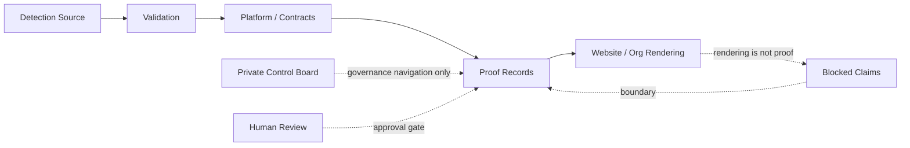

# Start Here

Start here if reviewing HawkinsOperations.

HawkinsOperations is a governed detection-engineering system that lets AI accelerate security work while evidence and human review authorize claims.

The enterprise AI failure mode is that AI-generated output becomes a public claim, analyst conclusion, operational action, security disposition, or executive truth before evidence and human review authorize it. HawkinsOperations is built to prevent that promotion path.

HawkinsOperations separates source, validation, runtime, signal, evidence, and public-claim truth. Each truth surface has a different owner and promotion gate.

Website content is rendering only. Repository source proves source existence only.

HO-DET-001 current public repo proof level: CONTROLLED_TEST_VALIDATED.

HO-DET-001 private/internal runtime material: non-public boundary context only.

HO-DET-001 public-safe status: NOT_PUBLIC_SAFE.

HO-DET-001 has merged source, Splunk source, and controlled-test validation artifacts. The public proof record supports controlled-test validation against controlled positive and negative process-creation fixtures.

HO-DET-001 validation enforcement exists through `HawkinsOperations/hawkinsoperations-validation#10`, merge commit `8b48500d2ebbaacd93ac88e77a31dccf1d3b4e25`, only for the exact checked controlled-test validation scope and only where the workflow is required by branch protection or a ruleset.

Proof-loop CI is a real control only where branch protection or a ruleset requires it, and only for the checked controlled-test validation scope. It does not prove runtime-active, signal-observed, evidence-linked public proof, public-safe, production-ready, fleet-wide, Cribl-routed, Wazuh-routed, AWS-live, private runtime host activity, autonomous SOC, or AI-approved disposition.

Platform runtime contract enforcement exists for HO-DET-001 through `HawkinsOperations/hawkinsoperations-platform#5`, merge commit `b3d0ffbd66c1bd5f60f7e9ff99712cdc3e0595bd`. The verifier preserves `CONTROLLED_TEST_VALIDATED`, `NOT_PUBLIC_SAFE`, `BLOCKED`, `runtime_active=false`, `signal_observed=false`, and `ai_decided_disposition=false`.

This platform contract is a non-promotional guardrail. It does not prove runtime-active status, signal-observed public proof, public-safe runtime proof, live Splunk fired, Splunk-proven Runtime Signal 001, Cribl-routed status, Wazuh-routed public proof, production-ready status, fleet-wide coverage, AWS-live status, autonomous SOC operation, AI-approved disposition, or analyst-approved disposition.

HO-DET-001 has private/internal runtime boundary context through validation PR [#22](https://github.com/HawkinsOperations/hawkinsoperations-validation/pull/22), proof PR [#14](https://github.com/HawkinsOperations/hawkinsoperations-proof/pull/14), and the proof record. This is not public-safe proof and must not be represented as runtime-active deployment, signal-observed public proof, production, fleet-wide, Cribl-routed, Wazuh-routed, AWS-live, autonomous SOC, AI-approved disposition, analyst-approved disposition, or public-safe status.

HOD-001 baseline artifacts do not validate HO-DET-001. They may inform review, but they do not promote the successor detection ID.

Public claims require reviewed wording, evidence linkage, stale review, and approval.

## Reviewer Control Panel

### 90-second command-center path

1. Open the [organization profile](./README.md) to see the six-repo command center.
2. Open the [currently visible private org control board route](https://github.com/orgs/HawkinsOperations/projects/2) for the operating cockpit. Treat it as work coordination only, not proof, approval, runtime state, signal state, or public-safe status. Project number is pending Project #1 reclaim closeout.
3. Open the [Repository Authority Map](../architecture/REPO_AUTHORITY_MAP.md) to confirm which repo owns each truth surface.
4. Open the [Control Status Matrix](../governance/CONTROL_STATUS_MATRIX.md) to confirm the current claim ceiling and blocked claims.
5. Open the [Proof Pack 001 Release](https://github.com/HawkinsOperations/hawkinsoperations-proof/releases/tag/hawkinsoperations-proof-pack-001) and [HO-DET-001 proof record](https://github.com/HawkinsOperations/hawkinsoperations-proof/blob/main/proof/records/HO-DET-001.md) for proof-owned claim boundaries.
6. Open the [Reproducible Reviewer Path](../architecture/REPRODUCIBLE_REVIEWER_PATH.md) only if you want clone-runnable inspection steps.

Current ledger snapshot: the proof-owned Lifetime Case Ledger public summary records 4 ledger events, 4 total cases, 0 public-safe cases, and 0 closed cases. Ledger status remains `NOT_PUBLIC_SAFE`; front-door/status proof ceiling remains `SCHEMA_CONTRACT_VERIFIER_EXISTS_ONLY`.

### 30-second reviewer path

1. Start with the [organization profile](./README.md) for the system summary.
2. Use the [Repository Authority Map](../architecture/REPO_AUTHORITY_MAP.md) to see which repo owns each truth surface.
3. Use the [Control Status Matrix](../governance/CONTROL_STATUS_MATRIX.md) to separate report-only routing from controls that block, fail, or force correction.
4. Inspect [hawkinsoperations-proof](https://github.com/HawkinsOperations/hawkinsoperations-proof) for proof records and claim ceilings.
5. Follow source and validation links only inside their stated scope.

### What to click first

| Question | Click |
|---|---|
| What is HawkinsOperations? | [Organization profile](./README.md) |
| Which repo owns which truth? | [Repository Authority Map](../architecture/REPO_AUTHORITY_MAP.md) |
| What is proven and what is blocked? | [Control Status Matrix](../governance/CONTROL_STATUS_MATRIX.md) |
| Where are proof records? | [hawkinsoperations-proof](https://github.com/HawkinsOperations/hawkinsoperations-proof) |
| Where are validators and case packets? | [hawkinsoperations-validation](https://github.com/HawkinsOperations/hawkinsoperations-validation) |
| Where is detection source? | [hawkinsoperations-detections](https://github.com/HawkinsOperations/hawkinsoperations-detections) |
| Where is public rendering? | [hawkinsoperations-website](https://github.com/HawkinsOperations/hawkinsoperations-website) |
| Where is the operating cockpit? | [currently visible private org control board route](https://github.com/orgs/HawkinsOperations/projects/2) |
| Where is the ledger summary? | [Lifetime Case Ledger public summary](https://github.com/HawkinsOperations/hawkinsoperations-proof/blob/main/proof/records/lifetime-case-ledger-v1-public-summary.json) |

### What each repo owns

| Repo | Owns | Does not own |
|---|---|---|
| `.github` | Reviewer routing and governance shell. | Proof, runtime state, signal state, or public-safe approval. |
| `hawkinsoperations-detections` | Detection source truth. | Validation, runtime, signal, or public proof. |
| `hawkinsoperations-validation` | Validation truth, fixtures, case packets, and deterministic checks. | Runtime deployment or public-safe proof. |
| `hawkinsoperations-platform` | Contracts, orchestration boundaries, and control logic. | Public proof or production readiness. |
| `hawkinsoperations-proof` | Proof records, evidence boundaries, and claim ceilings. | Raw private evidence publication or claim expansion by presentation. |
| `hawkinsoperations-website` | Public rendering and reviewer navigation. | Proof authority. |

### What is proven vs blocked

| Status | Current reviewer-safe wording |
|---|---|
| Proven within current public ceiling | HO-DET-001 source exists and controlled-test validation is recorded for the stated fixture scope. |
| Route-safe | GitHub and website surfaces route reviewers to source, validation, and proof records. |
| Ledger route-safe | The proof-owned Lifetime Case Ledger public summary routes bounded counts only: 4 events, 4 cases, 0 public-safe cases, 0 closed cases. |
| Blocked | Runtime-active, signal-observed, public-safe runtime proof, production-ready, autonomous SOC, AI-approved disposition, analyst-approved disposition, Cribl-routed, Wazuh-routed, AWS-live, fleet-wide, and live Splunk firing claims. |

### What not to infer

Do not infer runtime operation, signal observation, production readiness, fleet scope, public-safe approval, analyst disposition, AI disposition, or public proof from GitHub rendering, website rendering, issue status, private Control Board membership, branch names, diagrams, or docs alone.

The private Control Board exists for internal governance and navigation. It is not proof and is not public.

## Reviewer Links

- [Organization profile](./README.md)
- [Organization system map](../wiki/11_ORG_SYSTEM_MAP.md)
- [Cross-repo promotion map](../governance/CROSS_REPO_PROMOTION_MAP.md)
- [Governance summary](../governance/GOVERNANCE_SUMMARY.md)
- [PR review authority](../governance/PR_REVIEW_AUTHORITY.md) - merge governance routing; not runtime, signal, evidence, public-safe, or production proof unless backed by rulesets or blocking CI
- [Repository authority map](../architecture/REPO_AUTHORITY_MAP.md)
- [Control status matrix](../governance/CONTROL_STATUS_MATRIX.md)
- [Proof Pack 001 official GitHub Release](https://github.com/HawkinsOperations/hawkinsoperations-proof/releases/tag/hawkinsoperations-proof-pack-001) - bounded reviewer ZIP route for HO-DET-001; ZIP SHA256 `44d8a643aa2b113c9e99be0462e699d39af707a67190823cc05bb381907dc452`; public-safe runtime proof remains BLOCKED
- [Proof Pack 001 Discussion](https://github.com/orgs/HawkinsOperations/discussions/32) - official announcement route; rendering is not proof
- [Currently visible private org control board route](https://github.com/orgs/HawkinsOperations/projects/2) - operating cockpit for current work visibility; project number pending Project #1 reclaim closeout; not proof authority and not project metadata approval
- [Lifetime Case Ledger public summary](https://github.com/HawkinsOperations/hawkinsoperations-proof/blob/main/proof/records/lifetime-case-ledger-v1-public-summary.json) - bounded proof-owned count summary; ledger status remains `NOT_PUBLIC_SAFE`
- [HO-DET-001 proof record](https://github.com/HawkinsOperations/hawkinsoperations-proof/blob/main/proof/records/HO-DET-001.md)
- [HO-DET-001 runtime packet verifier PR #22](https://github.com/HawkinsOperations/hawkinsoperations-validation/pull/22)
- [HO-DET-001 verified runtime match proof PR #14](https://github.com/HawkinsOperations/hawkinsoperations-proof/pull/14)
- [HO-DET-001 platform runtime contract](https://github.com/HawkinsOperations/hawkinsoperations-platform/blob/main/contracts/examples/ho-det-001-runtime-contract.sample.json)
- [hawkinsoperations.com](https://hawkinsoperations.com) - current public rendering route, not proof
- [rayleeops.com](https://rayleeops.com) - public operating journal / external context, not HawkinsOperations proof
- [hawkinsops.com](https://hawkinsops.com) - legacy/reference route, not current proof authority

## Review Boundary

Allowed current wording:

- "HO-DET-001 source exists."
- "HO-DET-001 Splunk source exists."
- "HO-DET-001 passed controlled-test validation against controlled positive and negative process-creation fixtures."
- "HO-DET-001 validation enforcement exists for the exact checked controlled-test validation scope."
- "HO-DET-001 platform runtime contract enforcement exists as a non-promotional guardrail."
- "HO-DET-001 current public repo proof level is CONTROLLED_TEST_VALIDATED."
- "HO-DET-001 private/internal runtime material is non-public boundary context."
- "HO-DET-001 public-safe status is NOT_PUBLIC_SAFE."
- "HOD-001 baseline artifacts are separate reference material."

Blocked current wording:

- "HO-DET-001 is production-ready."
- "HO-DET-001 is fleet-wide."
- "HO-DET-001 is enterprise deployed."
- "HO-DET-001 is Cribl-routed."
- "HO-DET-001 is Wazuh-routed."
- "HO-DET-001 is public-safe."
- "HO-DET-001 public proof is complete."
- "Live Splunk fired as public proof."
- "HO-DET-001 is runtime-active" unless explicitly scoped to private controlled lab evidence.
- "HO-DET-001 has signal-observed status" unless explicitly scoped to private controlled lab signal observed.
- "HO-DET-001 is evidence-linked public proof."
- "HO-DET-001 has public-safe runtime proof."
- "HO-DET-001 has signal-observed public proof."
- "HO-DET-001 is AWS-live."
- "HO-DET-001 operates as autonomous SOC."
- "HO-DET-001 has AI-approved disposition."
- "HO-DET-001 has analyst-approved disposition."
- Any wording that exposes raw command lines, encoded payloads, LAN IPs, local artifact paths, raw CSV names, or screenshots as public evidence.
