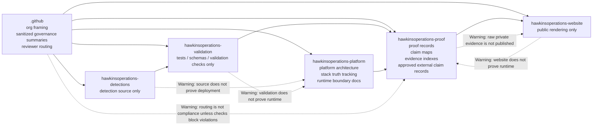
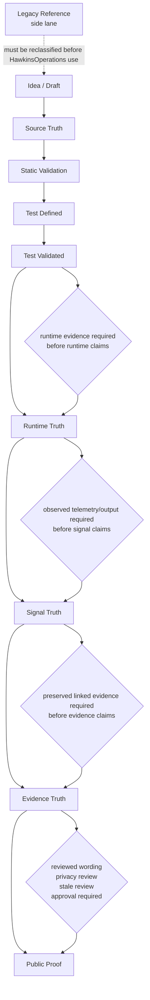
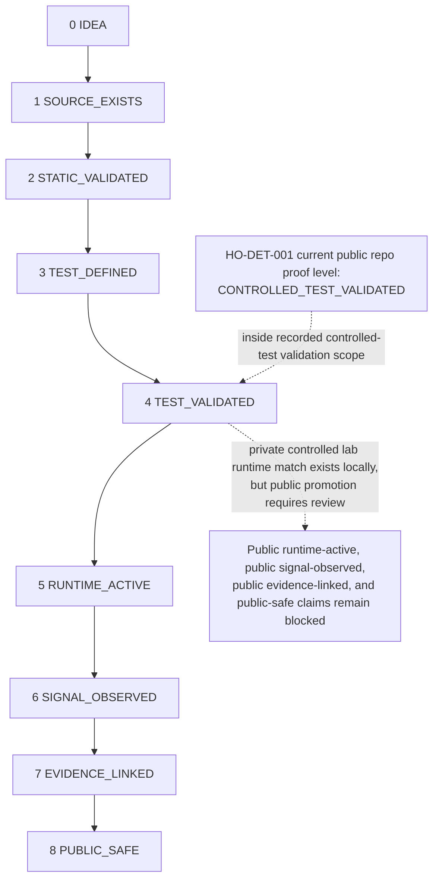
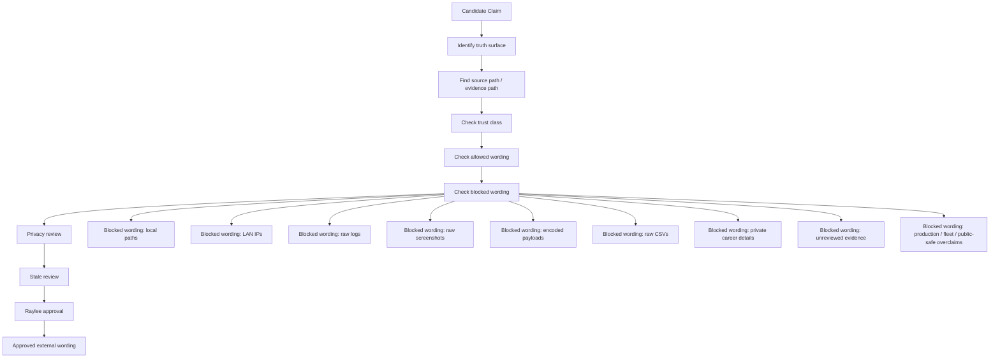
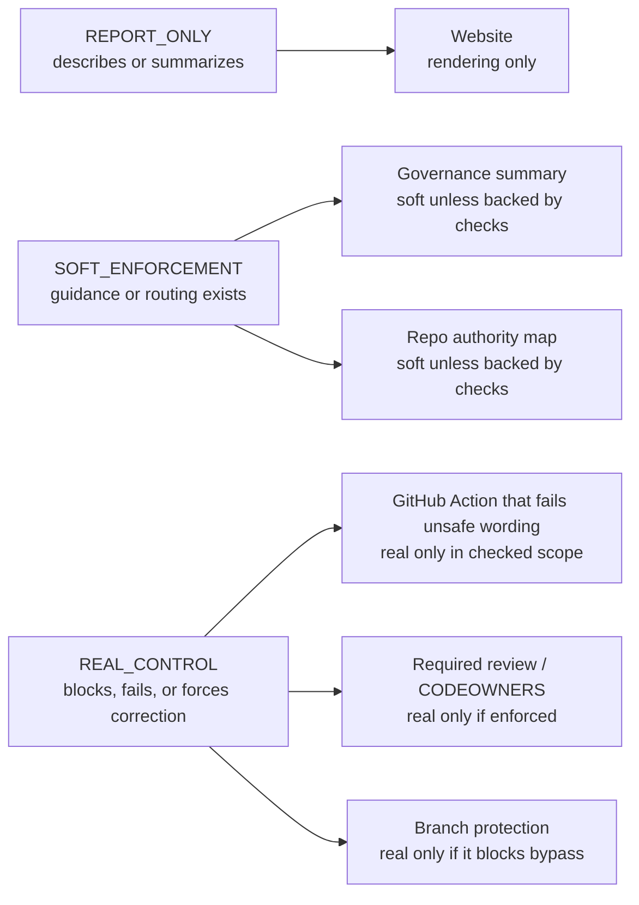
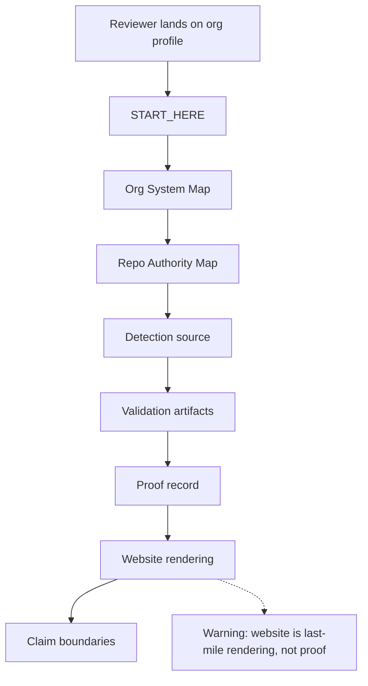

# HawkinsOperations Organization System Map

Status: REVIEWER_ROUTING
Trust class: SOURCE_EXISTS
Control type: reviewer routing / soft enforcement
Scope: Explains organization structure, repo ownership, truth surfaces, promotion flow, and control boundaries.
Can prove: This map exists and summarizes current reviewer routing.
Cannot prove: Runtime state, signal observation, evidence approval, production readiness, fleet coverage, Cribl routing, Wazuh routing, or public-safe proof.

## Purpose

This page is the visual operating map for HawkinsOperations.

It is a docs-as-code map, not a native GitHub Wiki page, so it remains reviewable through normal repository governance.

This map is explanation and reviewer routing only. It does not create proof, promote artifacts, approve evidence, or make runtime claims public-safe.

## One-Sentence Model

HawkinsOperations separates source, validation, runtime, signal, evidence, public proof, and legacy reference surfaces so no claim is promoted beyond what its evidence supports.

## Diagram: Organization Repo Map

## Diagram: Truth Surface Flow

## Diagram: Detection Proof Ladder

HO-DET-001 current public repo proof level: CONTROLLED_TEST_VALIDATED.

HO-DET-001 validation enforcement exists through `HawkinsOperations/hawkinsoperations-validation#10`, merge commit `8b48500d2ebbaacd93ac88e77a31dccf1d3b4e25`, only for the exact checked controlled-test validation scope.

Proof-loop CI is a real control only for that exact checked controlled-test validation scope. It does not prove runtime-active, signal-observed, evidence-linked public proof, public-safe, production-ready, fleet-wide, Cribl-routed, Wazuh-routed, AWS-live, HO-GPU-01 runtime-active, autonomous SOC, or AI-approved disposition.

HO-DET-001 platform runtime contract enforcement exists through `HawkinsOperations/hawkinsoperations-platform#5`, merge commit `b3d0ffbd66c1bd5f60f7e9ff99712cdc3e0595bd`. It is a non-promotional guardrail that preserves `CONTROLLED_TEST_VALIDATED`, `NOT_PUBLIC_SAFE`, and `BLOCKED`; it does not prove runtime-active status, signal-observed public proof, public-safe runtime proof, live Splunk fired, Splunk-proven Runtime Signal 001, Cribl-routed status, Wazuh-routed public proof, production-ready status, fleet-wide coverage, AWS-live status, autonomous SOC operation, AI-approved disposition, or analyst-approved disposition.

Private controlled lab runtime match exists locally, but public runtime-active, public signal-observed, public evidence-linked, and public-safe claims remain blocked pending reviewed wording, privacy review, stale review, evidence linkage review, and Raylee approval.

## Diagram: Public Claim Gate

## Diagram: Control Reality Map

## Diagram: Reviewer Navigation Path

## Rules of Interaction

- No repo may claim another repo's truth surface.
- Source files do not prove runtime.
- Runtime does not automatically create public proof.
- Evidence-linked does not automatically mean public-safe.
- Legacy reference does not become HawkinsOperations truth by copy-paste.
- AI may draft, inspect, compare, and implement scoped tasks.
- AI may not own truth, approve public claims, promote artifacts, or declare runtime active.
- Real control only means something blocks, fails, or forces correction.

## Current Org State Summary

The `Claim blocked` column is blocked wording from `governance/CONTROL_STATUS_MATRIX.md`. These entries are included to preserve public claim boundaries, not to assert those claims.

| Item | Current status | Claim allowed | Claim blocked |
| --- | --- | --- | --- |
| Organization profile | Soft routing only | The profile routes reviewers to truth boundaries. | Blocked wording: the profile proves runtime, validation, or public proof. |
| Governance summary | Soft enforcement | Governance summary describes expected gates. | Blocked wording: governance text alone is a real control. |
| Repo authority map | Soft enforcement | The map defines repository ownership boundaries. | Blocked wording: the map proves a repo complied. |
| Website | Rendering only | Website content is rendering only. | Blocked wording: website presentation proves source, runtime, signal, or evidence truth. |
| HO-DET-001 source | SATISFIED | HO-DET-001 source exists. | Blocked wording: HO-DET-001 is production-ready, fleet-wide, public-safe, or deployed. |
| HO-DET-001 Splunk source | SATISFIED | HO-DET-001 Splunk source exists. | Blocked wording: Live Splunk fired as public proof. |
| HO-DET-001 controlled-test validation | SATISFIED | HO-DET-001 passed controlled-test validation against controlled positive and negative process-creation fixtures. | Blocked wording: HO-DET-001 is production-ready, fleet-wide, public-safe, or catches attacks in production. |
| HO-DET-001 validation enforcement | SATISFIED | HO-DET-001 validation enforcement exists for the exact checked controlled-test validation scope. | Blocked wording: validation enforcement proves runtime-active, signal-observed, evidence-linked public proof, public-safe, production, fleet, Cribl, Wazuh, AWS-live, HO-GPU-01 runtime-active, autonomous SOC, or AI-approved disposition. |
| HO-DET-001 platform runtime contract enforcement | SATISFIED | HO-DET-001 platform runtime contract enforcement exists as a non-promotional guardrail. | Blocked wording: platform contract enforcement proves runtime-active, signal-observed public proof, public-safe runtime proof, live Splunk fired, Splunk-proven Runtime Signal 001, Cribl-routed, Wazuh-routed public proof, AWS-live, production-ready, fleet-wide, autonomous SOC, AI-approved disposition, or analyst-approved disposition. |
| HO-DET-001 private controlled lab runtime match | SATISFIED_PRIVATE_LAB_SCOPE | A private controlled lab runtime match has been captured locally, but public-safe promotion remains blocked pending review. | Blocked wording: Live Splunk fired as public proof; raw command lines; encoded payloads; LAN IPs; local artifact paths; raw CSV names; screenshots as public evidence. |
| HO-DET-001 public runtime-active | BLOCKED | Runtime-active status remains blocked on public surfaces. | Blocked wording: HO-DET-001 is active in production. |
| HO-DET-001 public signal-observed | BLOCKED | Signal-observed status remains blocked on public surfaces unless scoped as private controlled lab signal observed. | Blocked wording: HO-DET-001 has public signal proof. |
| HO-DET-001 public evidence linkage | BLOCKED | Evidence-linked public proof remains blocked. | Blocked wording: HO-DET-001 public proof is complete. |
| HO-DET-001 public-safe | BLOCKED | Public-safe status is blocked pending reviewed wording, privacy review, stale review, evidence linkage review, and Raylee approval. | Blocked wording: HO-DET-001 is public-safe. |

## Links

- [Organization profile](../profile/README.md)
- [START_HERE](../profile/START_HERE.md)
- [Governance summary](../governance/GOVERNANCE_SUMMARY.md)
- [Control status matrix](../governance/CONTROL_STATUS_MATRIX.md)
- [Repository authority map](../architecture/REPO_AUTHORITY_MAP.md)
- [HO-DET-001 proof record](https://github.com/HawkinsOperations/hawkinsoperations-proof/blob/main/proof/records/HO-DET-001.md)
